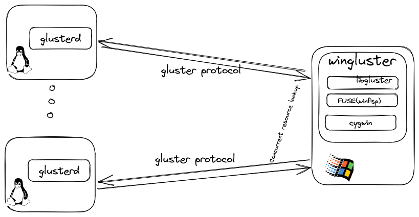

# WinGluster - A Windows client for GlusterFS

## Introduction

WinGluster is a Windows system client developed specifically for the Gluster file system. In order to use the Gluster file system on a client, the native Gluster client or NFS is generally used in Unix-like systems. However, in Microsoft Windows systems, the Samba service needs to be deployed on the Gluster server, and SMB file sharing is used to connect to the Windows client.

Using Samba in Gluster is a proxy method, and the client and Gluster service require Samba proxy forwarding. Although this method is functional, performance is difficult to guarantee. The most obvious problem is that browsing Gluster resources in Windows Explorer becomes intolerably slow.

This solution provides a way to directly connect to the Gluster server using the native Gluster protocol in Windows. This provides better performance and compatibility.

## Principle

## Development notes

This software uses Cygwin, which is a Linux emulation software in Windows. The poll function of Cygwin is relatively inefficient and needs to be enhanced, but this function is not included in this code. The link is as follows: [https://cygwin.com/](https://cygwin.com/)

This software uses WinFsp, which is a FUSE software for Windows. The link is as follows: [https://winfsp.dev/](https://winfsp.dev/)

This code is based on Gluster version 3.12 and is limited to this version.

## Contribution

Welcome to participate in the development and maintenance of this project.

## License
WinGluster is licensed under [LGPLV3+](COPYING-LGPLV3).